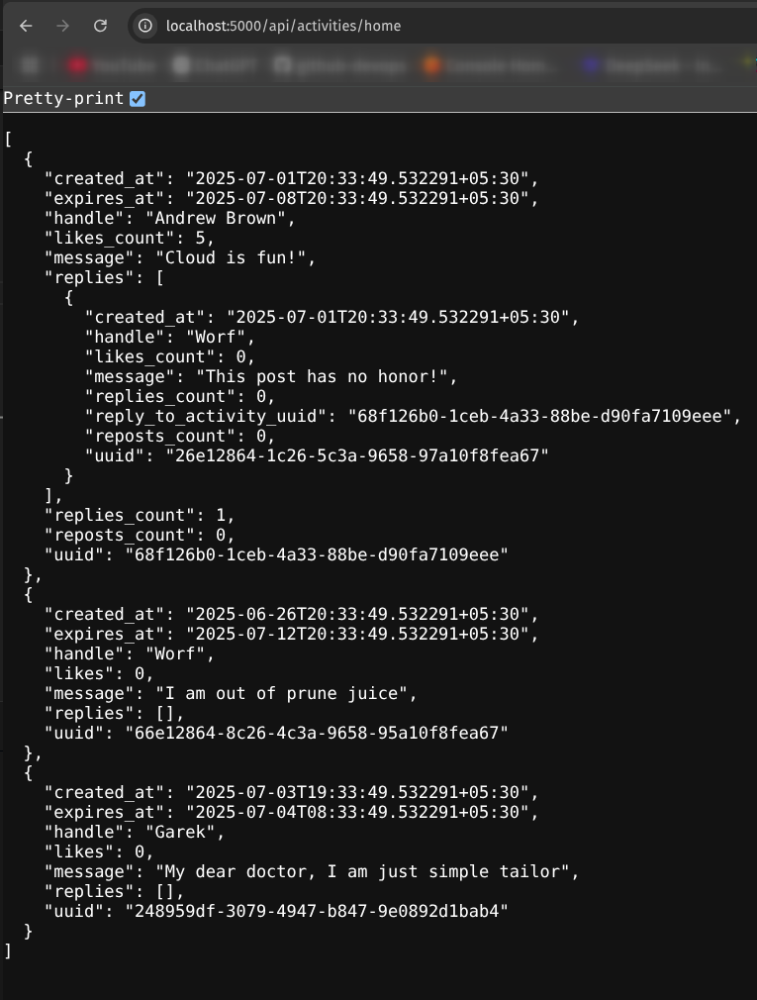
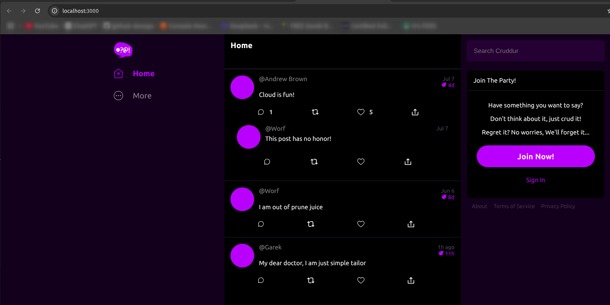

# App Containerization Project Scope

The scope of this project is to demonstrate containerization skills by creating Dockerfiles for the development environment. It includes containerizing an ephemeral micro-blogging application and setting up a `docker-compose.dev.yml` file that can be used by both developers and DevOps engineers to run the application stack locally.

I will be documenting the steps I followed and core Docker concepts along the way.

### Understand the Ephermeral Micro-Blogging Application Stack

The application which we are going to containerize is a micro-blogging platform application (ephemeral in nature) that allows users to post updates that automatically expire after a period of time. The application has the following stack:

- Frontend - React
- Backend - Flask
- Feed Conversations - PostgreSQL
- Private Messages - DynomoDB

### What is Containerization Technology? Why Someone Must Use It?

Containers came into existence because of the classic well known issue "it works on my machine". As a developer, when you're bulding applications you might have set of frameworks, libraries, dependenices, and runtime enivronments configured into your system. Similarly the stage and prod environments might have standard environments configured. When you deploy your code into stage or production enivronments and if there's a mismatch with the configuration, then the application might break.

Containers solved this issue by offering consistency and portability across all environments. They bundle the app with everything it needs to run, regardless of where it's deployed.


### How Are Containers Different From VMs?

Unlike VMs, containers share the same operating system kernel and isolate the application processes from the rest of the system so the whole thing can be migrated, opened, and used across development, testing, and production configurations. 

### What is Docker? How Is It Related to Containers?

Docker is the most widely used container platform. It packages your application and its dependencies into a container image, which can then be run consistently across development, testing, and production.

Inside each Docker container, the app gets its own filesystem, dependencies, and runtime—isolated from the host.

### Running the application locally

After having the application stack understanding, it's time to run the app locally (without database). By running the app locally we will understand the application building steps which we help us to simulate the same steps when contanierizing the application.

First things first, you must create a `.env` file under the root of backend-flask and frontend-react-js folders. What needs to go inside `.env` file ? refer to `.env.example` file and add the same variables.

To run the backend application follow these steps:
```
cd backend-flask
python3 -m flask run
```
Go to your browser and enter localhost:5000/api/activities/home

> port **5000** is the default port on which Flask runs

> 5000/api/activities/home - is the API end-point that shows the data




To run the frontend application follow these steps:
```
cd frontend-react-js
npm install #installs all required packages from package
npm start
```

Tada! localhost:3000 automatically opens in the browser.




If you're able to run the backend and frontend successfully, you're ready to containerize the application.

Refer to the following links to learn the steps involved in Dockerizing the application and configuring image secuirty scanning:


[Backend-dockerization](https://github.com/devops-champ/app-containerization-project/blob/main/_docs/backend-docker.md#dockerize-the-backend-framework)

[Frontend-dockerization](https://github.com/devops-champ/app-containerization-project/blob/main/_docs/frontend-docker.md#dockerize-the-frontend-framework)

[Docker-compose](https://github.com/devops-champ/app-containerization-project/blob/main/_docs/docker-compose.md#docker-compose)

[Container security best practices](https://github.com/devops-champ/app-containerization-project/blob/main/_docs/container-security-best-pactices.md#container-security-best-practices)


**CREDITS** - The source code of this project belongs to AWS Bootcamp by Andrew Brown.
